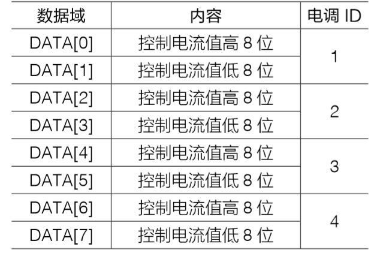
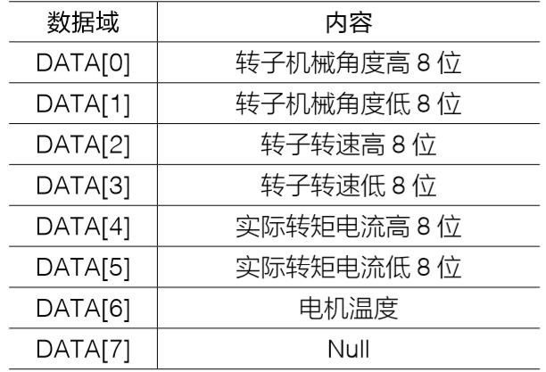

# FOC

## 1.将文件夹提交到一个新创建的github服务器

```bash
echo "# miniFOC" >> README.md
git init
git add README.md
git commit -m "first commit"
git branch -M main
git remote add origin https://github.com/mailonghua/miniFOC.git
git push -u origin main
```


## 2.CAN协议

一条CAN报文控制4个电机，因此自研电机均用0X300作为ID

接收的报文：



- 一条报文同时控制4个电机
- 四个电机会同时收到报文，然后根据自己的ID进行选取


发送的报文：

标识符：0X300+电机ID，如0X301



- 电机温度传输控制芯片内部温度


## 3.按键的控制

### 3.1.调整CAN ID

短按用来调整CAN ID，LED灯的闪烁的次数，用来调整ID从0~4，数字就是LED闪烁的次数

​	那么对应的CAN ID就是 CAN_ID = 0x300 + id构成

注意：当调节完ID后，会记录到SOC内部的NVS中，需要重新启动才会生效

### 2.开启或关闭WIFI-用于OTA

2秒长按会开启或关闭wifi模式，当链接到网络则会有滴滴提示音

### 3.清除所有的NVS

大于3.5秒长按会清除所有NVS中保存的数据

此时重新上电，电机则会进行校准状态，并将校准数据写入到NVS中，同时CAN ID为默认的0x300

## 4.串口指令

| 指令   | 说明                          | 返回值                 |
| ------ | ----------------------------- | ---------------------- |
| 0x5500 | 获取系统状态                  | 0：Success<br />1:Fail |
| 0x5501 | 开启WIFI                      | 0：Success<br />1:Fail |
| 0x5502 | *关闭WIFI*                    | 0：Success<br />1:Fail |
| 0x5503 | 清空NVS                       | 0：Success<br />1:Fail |
| 0x5504 | 开启BLE\<todo>                | 0：Success<br />1:Fail |
| 0x5505 | 关闭BLE\<todo>                | 0：Success<br />1:Fail |
| 0x5506 | 设置重新修改WIFI和SSID\<todo> | 0：Success<br />1:Fail |
| 0x5507 | 失能电机                      | 0：Success<br />1:Fai  |


## 注意事项

1.OTA升级后再使用USB刷新固件

如果在使用了OTA进行升级后，再使用USB进行固件刷新，请先试用platormIO的清除整个Flash再刷新才会生效，OTA在更新时会修改使能缓冲区
